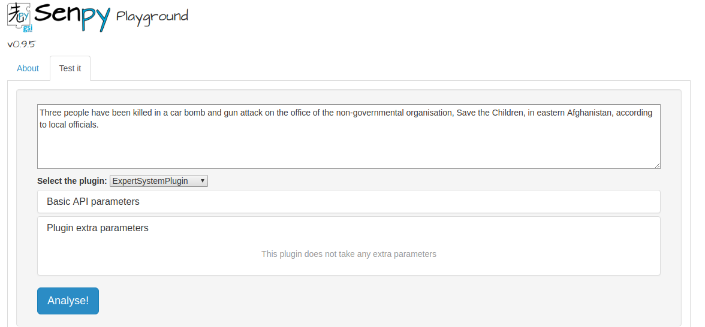
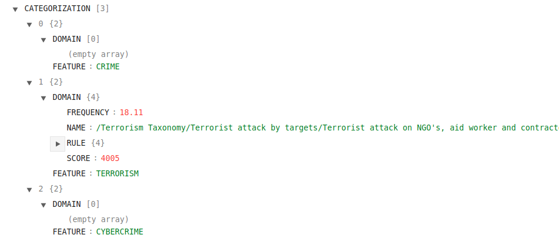
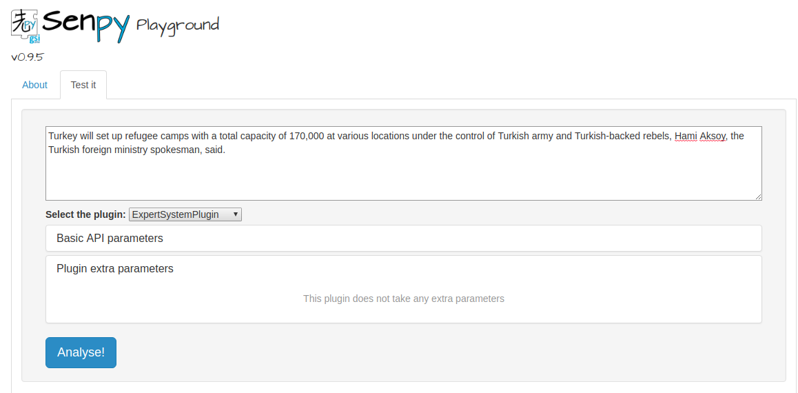
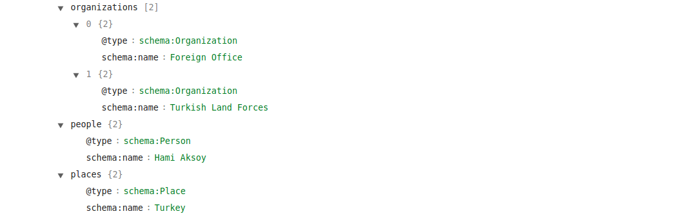

# COGITO plugin

Plugin for analyzing texts using the expert systems COGITO API. The response indicates if a text is categorized as Crime, CyberCrime or Terrorism, and also extracts entities appearing on it (organizations, places and people).


## Setup

First, you will need to install Senpy service. All the documentation for Senpy can be found [here](http://senpy.readthedocs.io/en/latest/).

The easiest way to install it is using pip:

```
pip install --user senpy
```

Once senpy is installed, you have to clone this repo:

```
git clone http://lab.cluster.gsi.dit.upm.es/trivalent/cogito-plugin.git
```

Then, move into your repository folder and start the senpy service.

``` 
cd cogito/
senpy -f .
```

Once this is done, the service will be available at localhost:5000.

## Programatical access

Run the following query, being TEXT_TO_ANALYZE the text you want to analyze.

```
localhost:5000/api?algo=ExpertSystemPlugin&i=<TEXT_TO_ANALYZE>
``` 

## Web interface access

1. Go to your web browser and search _localhost:5000_.
2. Write the text you want to analyze.
3. Paste you text and click the Analyse button.


Categorization example.





Entity extraction example.





